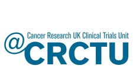

The `bootcamp` R package contains materials written to train new biostatisticians at Cancer Research UK Clinical Trials Unit at the University of Birmingham. 
Sessions are presented as [learnr](https://rstudio.github.io/learnr/) tutorials.

Content includes:

* Folder structure for trial analysis directories;
* Using [R](https://www.r-project.org/) & [RStudio](https://www.rstudio.com/)
* Using [git](https://git-scm.com/)
* Using [ggplot2](https://r4ds.had.co.nz/data-visualisation.html)
* Using [markdown](https://en.wikipedia.org/wiki/Markdown) and [pandoc](https://pandoc.org/)
* Using [Rmarkdown](https://rmarkdown.rstudio.com/)
* Core skills in [Stata](https://www.stata.com/)
* and loads more

If you use any of these materials or want to do something similar at your institution, please drop a line to kristian.brock@gmail.com.

