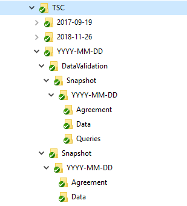

```{r setup, include=FALSE}
library(learnr)
knitr::opts_chunk$set(echo = TRUE)

# Any setup R code can go here
library(dplyr)
# Etc

```


## Welcome

This tutorial introduces you to a standard folder structure for the analysis directory of clinical trials at CRCTU.

### Learning Objectives
Upon completion of this session, you will be able to:

* identify which materials belong in the analysis directory;
* identify where items belong;
* store files in the correct location;
* understand task-based analysis.


## Trials documents

Clinical trials generate lots of documentation.
Over its lifetime, each trial will have:

* a protocol;
* a statistical analysis plan (SAP);
* a series of case report forms (CRFs);
* a list of critical data items (CDI);
* a data validation plan (DVP);
* data snapshots for cleaning and analysis;
* analysis code;
* analysis output;
* reports to monitoring committees;
* manuscripts, abstracts and posters;
* an end of trial report;
* and more.

Some of these documents will be the topics of later training.
For example, there is a session on statistical analysis plans, and another on approaches to data cleaning, including the use of the CDI and DVP documents.

You might now be convinced that trials generate lots of documentation.
It is not clear, however, _why_ we have all this documentation.


## Why all the documentation?


*Clinical research is a highly regulated activity* because patients' lives are at stake.
What standards would you expect from someone performing experiments on one of your parents? 
Or your child?
Clinical research is most often borne out of necessity - patients undergo research and we conduct research with the ultimate aim of improving health-related outcomes.
We have obligations to the patient to do that safely and rigourously.
The competent authority, in the UK the Medicines and Health Regulatory Agency (MHRA), will audit our documentation.

*Clinical trials are a method of scientific experimentation and research.*
We want to collect observations that give a fair reflection of the treatments' properties.
To maximise the chances of this, we formalise in advance how the experiment will proceed.

*Clinical trials take years to complete*.
Over its lifetime, each trial will involve many people, and likely several statisticians.
We produce documentation to record our progress.
This will allow others to contribute along the way.


## Analysis Directory

We propose that each CRCTU clinical trial will have an _Analysis Directory_ to hold the materials produced by statisticians in the act of analysing a clinical trial, including testing and data-cleaning.

The top-level looks like this:


We see that the `CDAID` trial associated with the `D3B` team, has an analysis directory called `CDAIDAnalysis` that sits directly below the trials's root folder `T:\Trials Work\D3B\CDAID\`.

The first folder we shall note is the `Publications` directory.
This is where all materials related to (you guessed it) publications reside.
Publications do not just include journal papers, however.
The term also covers conference abstracts and posters.

Two other important folders to highlight are `DMC` and `TSC`.
These store materials related to meetings of the data monitoring committee (DMC) and trial steering committee (TSC) respectively. 

`Database` is the home for materials created in relation to database testing and `Randomisation` the home for material related to the creation of randomisation lists or testing the randomisation algorithm.

`EndOfTrial` will eventually hold analysis related to the end-of-trial report.

`Design` contains materials related to the design of the trial.
This will most likely be pertinent during the grant application stage, and might detail sample size calculations, intended analysis methods, or how to run simulations to generate operating characteristics of the design.

Lastly, the `AdHoc` directory contains materials that do not belong under the other folders.
This folder should be used infrequently.
I use it for data cleaning tasks that are not related to a meeting or publication.

A trial that uses all of these folders might fill them up in the following order:

1) Design
2) Randomisation
3) Database
4) AdHoc
5) DMC
6) TSC
7) Publications
8) EndOfTrial

Not every trial will use every directory, however.
Some trials do not use randmoisation; some do not have a DMC.
In those examples, the superfluous folders can just remain empty.

## TSC Substructure

An example of the directory structure below the `TSC` folder is shown below. 



In this particular example, the trial had TSC meetings on 2017-09-19 and 2018-11-26.
Each of these would have contained the analysis and associated data snapshots that were presented at those meetings.
The structure below each would have mirrored the `YYYY-MM-DD` directory expanded above.

We see that there is a `DataValidation` sub-directory.
It is intended that this would contain evidence of data cleaning and queries.
A future bootcamp lesson will conduct hands-on data cleaning examples.

We also see the `Snapshot -> YYYY-MM-DD` pair in several places, with subdirectories including `Agreement` and `Data`.
This pattern is used again and again in the analysis directory so it is worthy of explanation,
`YYYY-MM-DD` would be replaced with the date that the snapshot was taken.
`Agreement` would hold evidence that the trials staff had confirmed that all available data was added to the database and that the statistician should take a snapshot.
Usually this would take the form of an email.
Our quality management processes require this communication to be filed to demonstrate that reasonable measures were taken to ensure no data was unnecessarily omitted. 
Further bootcamp sessions will demonstrate the hands-on process of taking a database snapshot in R and Stata.

## What's in and what's out?

In this section we discuss what goes in the analysis directory, and what does not.

### What's out?
You might have noticed that some documents are seemingly not covered in the analysis directory.
Where should the protocol and SAP go, for instance?

The formal suite of documentation intended to primarily be produced before a trial starts, generally created in Word, including the protocol, SAP, CRFs, CDI, DVP _do not belong in the analysis directory_.
These documents generally necessitate collaboration with teams outside of Biostatistics.
Their content is the topic of documents in CRCTU's quality management system (QMS).
These documents have their own version control and sign-off processes.


### So what's in?
The analysis directory should contain all files created during the analysis of a trial, including data snapshots and materials related to testing and cleaning.
These documents belong solely to the biostatistics team.
Their content:

* demonstrates that we followed the QMS;
* would be pertinent in an audit of statistical processes;
* justifies the information that we conveyed to the outside world.

The following list is not exhaustive, but we expect that the following file-types (with example file extensions) related to a trial would always be stored in the analysis directory:

* R scripts (`.R`) 
* RMarkdown documents (`.Rmd`) and their compiled counterparts (`.md`, `.html`, `.tex`, `.doc`, `docx`)
* Stata input files (`.do`)
* Stata logs (`.smcl`)
* LaTeX files or chunks (`.tex`)
* Notes to file (`.txt`, `.md`, `.doc`, `.docx`)
* Snapshotted data-files  (`.rds`, `.dta`, `.csv`, `.xls`, `xlsx`)


## Quiz

Test your memory.
Which of the following documents belong in the analysis directory?

```{r quiz, echo = FALSE}
quiz(
  
  question("DMC report",
    answer("TRUE", correct = TRUE),
    answer("FALSE", correct = FALSE)
  ),
  
  question("Statistical analysis plan",
    answer("TRUE", correct = FALSE),
    answer("FALSE", correct = TRUE)
  ),
  
  question("Data validation plan",
    answer("TRUE", correct = FALSE),
    answer("FALSE", correct = TRUE)
  ),
  
  question("The results of invoking the checks described in the data validation plan",
    answer("TRUE", correct = TRUE),
    answer("FALSE", correct = FALSE)
  ),
  
  question("Script used to take a database snapshot",
    answer("TRUE", correct = TRUE),
    answer("FALSE", correct = FALSE)
  ),
  
  question("Email communication to show that it was OK to take a database snapshot",
    answer("TRUE", correct = TRUE),
    answer("FALSE", correct = FALSE)
  ),
  
  question("Approved drafts of the case-report forms",
    answer("TRUE", correct = FALSE),
    answer("FALSE", correct = TRUE)
  ),
  
  question("Ad-hoc script used to generate some data queries",
    answer("TRUE", correct = TRUE),
    answer("FALSE", correct = FALSE)
  )
)
```


## Version control
A core function of the analysis directory is to make it possible to version-control all analyses in a single over-arching directory.
We do this using version-control software called git.
There will be a bootcamp session devoted to using git.


### Creating the analysis directory
Creating the standard analysis directory structure is scripted in Windows Powershell.
Because of the potential havoc that could be wrought by executing scripts that tweak directory structure in an automated manner, the creation script is currently under restricted use.
The creation script does more than make directories.
It also instantiates a git repository, facilitating version control.
If you want to generate an analysis directory for a trial that does not already have one, please speak to Kristian.

If you want to explore the folder structure, there is an example at 

T:\\FolderStructure\\

Please do not copy and paste this demo directory to create instances of an analysis directory because you will not get source control.
Instead, chat to KB.


## Analysis tasks

Using an analysis directory and pairing it with version control software like git promotes a modular approach to trial analysis, where small, discrete, well-defined tasks are conducted and then added to the trial's analysis repository.

This sounds quite abstract.
An example might make it more tangible.

Under this approach with version-control provided by git, the following sequence might describe the analysis events that took place on a particular trial in one calendar quarter:

1) **Day 1** - Take a database snapshot for cleaning data in anticipation of DMC meeting two months from now. **Commit to git** the snapshot, the files used to take the snapshot, and the correspondence with the trial coordinator (TC).
2) **Day 3** - Run data checking scripts on the data cleaning snapshot, as detailed in DVP. **Commit to git** the checking scripts and the generated list of queries.
3) **Day 23** - Receive email from TC that all queries have been resolved, inviting you to take analysis snapshot. **Commit to git** the snapshot, the files used to take the snapshot, and the correspondence with the TC.
4) **Day 46** - Complete DMC report. **Commit to git** the analysis scripts and the automatically generated report.
5) **Day 67** - After the meeting, perform a little extra analysis in response to DMC queries. **Commit to git** an R notebook used to perform the analysis on the DMC snapshot.

In this example, there were 5 analysis tasks.
After each, the materials created pertaining to that particular task were added to source control provided by git.
Files are layered onto the analysis heap in a meaningful, sensible order. 

Any statistician picking up the trial on Day 25, for instance, would see that a DMC snapshot had been taken after some data queries were resolved, but that the report had not yet been created.
For this to work, commits to the repository must be made promptly, as soon as practicable after an analtsis task is completed.

For instance, if the snapshot had not been committed on Day 23, any statistician peeking at this trial on Day 25 would not know about the snapshot.
The danger is that they then unnecessarily replicate work.
The lesson is to commit promptly.

We will work through examples later in bootcamp.

## Summary

The analysis directory, twinned with source control, facilitates a modular or incremental analysis pathway with frequent meaningful checkpoints.
This level of organisation will make it possible for any statistician to pick up any trial and make sense of where the trial has been, and more importantly, where it is headed.

The analysis directory is not widely used in CRCTU.
But you are all strongly encouraged to use it.
If you work with Kristian at all, you will be using it.
We will use it repeatedly during bootcamp.

Welcome to CRCTU!

